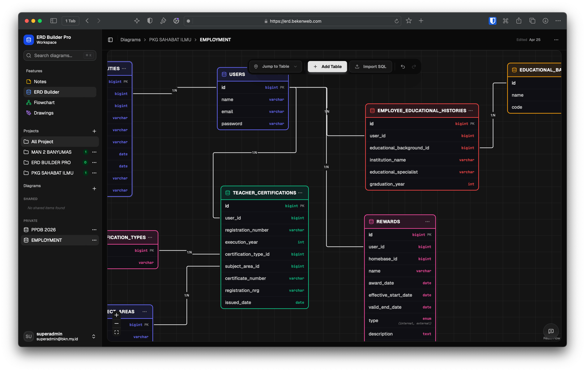

# Introduction

ERD Builder Pro is a modern database design tool that integrates _Entity Relationship Diagram (ERD)_ creation with an automatic SQL generator, a Tiptap-based technical notes system, and _flowchart_ and freeform design features using Excalidraw, all in one integrated documentation platform.

Designed specifically for **Software Developers**, **Database Architects**, and **Technical Teams**, this application helps you manage the entire database design lifecycle from visualization to technical documentation without needing to switch between applications.

## Why ERD Builder Pro?
- **Offline First**: Data security is guaranteed with initial local storage in **IndexedDB**, allowing you to stay productive even when disconnected. Data will be automatically synced to the cloud when you come back online.
- **All-in-One Documentation**: Combine database schemas, business rules, and application flow diagrams in one workspace.
- **High Productivity**: Generate SQL code or migrations for your favorite frameworks (Laravel, Prisma, etc.) instantly.
- **Full Customization**: Store your data and assets in your own cloud infrastructure (Supabase & Cloudflare).

## Technology & Libraries

This application is built on a modern technology ecosystem and outstanding *open-source* libraries:

### Core Infrastructure
- **Frontend**: React + Vite for a fast and responsive interface.
- **Backend**: Express.js for server logic and APIs.
- **Database**: Supabase (PostgreSQL) for data storage.
- **Storage**: Cloudflare R2 for image asset storage.

### Core Libraries (Credits)
We thank the developers behind the following key technologies:
- **[React Flow](https://reactflow.dev/)**: Used as the core engine for building the interactive ERD interface.
- **[Tiptap](https://tiptap.dev/)**: A rich text editor powered by ProseMirror for the Notes feature.
- **[Excalidraw](https://excalidraw.com/)**: Used for freeform design (Drawings) and flow diagrams.

## Future Roadmap

We are continuously working to develop ERD Builder Pro into an even more powerful tool for developers. Here are some major features planned for the future:

| Feature | Status |
| :--- | :--- |
| **AI-Powered ERD Generation** | ✅ Available |
| **Team Collaboration & Role-Based Access** | 🔜 Planned |
| **Broader SQL Dialect Support** | 🔜 Planned |
| **Enhanced Export** | 🔜 Planned |
| **Desktop Application** | 🔜 Planned |
| **Local Database Runner** ⚡ | 🔜 Planned |
| **Mindmap** | 🔜 Planned |
| **API Mapper** | 🔜 Planned |
| **Task Workspace** | 🔜 Planned |

> [!NOTE]
> All the above features are designed to be integrated within a single ecosystem. **Mindmap** is a place for planning ideas, **ERD & Flowchart** for structure visualization, **Task Workspace** for managing execution, and **API Mapper** for documenting data pathways — all interconnected. With **Team Collaboration**, the entire team can contribute in real-time.